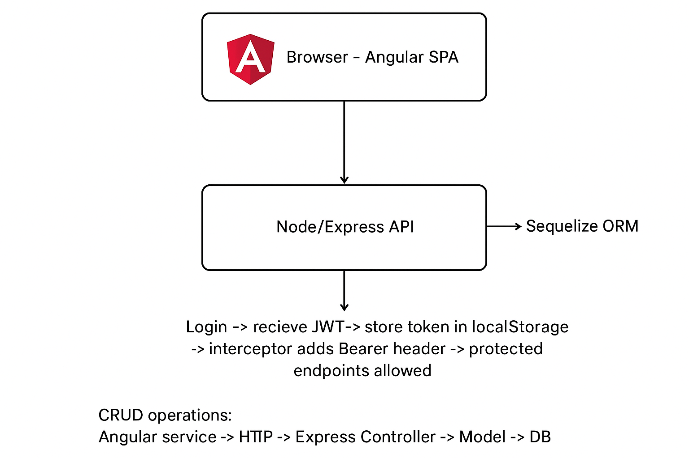
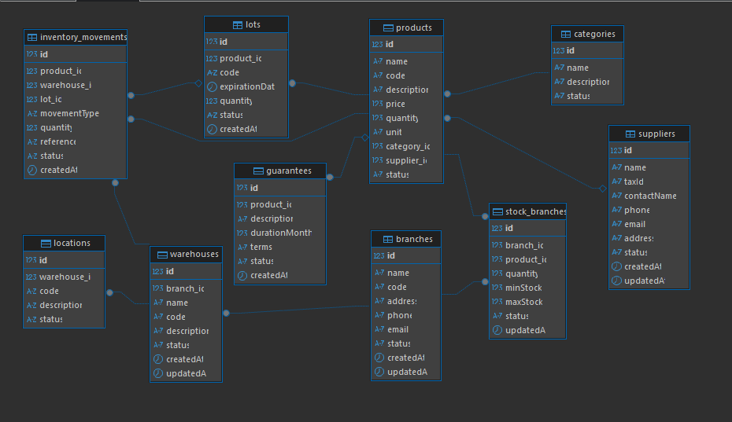
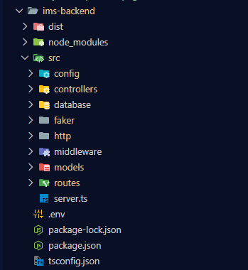

# 📘 SYSTEM DOCUMENTATION

## 1. Project Information

- Project Name: Inventario Multi Sucursal (IMS)
- Student Name: [Dairo Alfonso Arcia Macea]
- Course: [Desarrollo Web]
- Semester: [8vo]
- Date: [21/11/2025]
- Instructor: [Jaider Quintero]

Short Project Description:
This project is a multi-branch inventory management system. The application allows administrators to manage products, categories, warehouses, branches, stock movements, lots and user roles. The backend is implemented with Node.js, Express and Sequelize (supporting several DB engines). The frontend is a modern single-page app built with Angular 20, PrimeNG and Tailwind CSS.

---

## 2. System Architecture Overview

### 2.1 Architecture Description

IMS is a typical two-tier web application with a RESTful API backend and a single-page frontend. The backend exposes REST endpoints under `/api` (and some non-prefixed routes for legacy or convenience). It uses Sequelize ORM to map models to a relational database (MySQL/Postgres/MSSQL/Oracle supported). The frontend is an Angular application that consumes the backend API, provides authentication, role-based UI and CRUD screens for each domain model.

Key architectural elements:
- Client (Angular): UI components, services, route guards, HTTP interceptors and state in localStorage.
- Server (Node + Express): controllers, routes, middleware (auth), models (Sequelize) and DB connection.
- Database: relational database (MySQL recommended for local dev) managed by Sequelize.
- Authentication: JWT access tokens and refresh-token persistence in DB.

### 2.2 Technologies Used

- Frontend: Angular 20, TypeScript, PrimeNG (UI components), PrimeUI theme (@primeuix/themes), Tailwind CSS
- Backend: Node.js, TypeScript, Express.js, Sequelize ORM
- Database Engine: MySQL (default), Postgres, MSSQL or Oracle supported (configured by `DB_ENGINE` env var)
- Additional Libraries / Tools: jsonwebtoken, bcryptjs, dotenv, nodemon, ts-node, mysql2/pg/tedious/oracledb

### 2.3 Visual explanation of the system’s operation




---

## 3. Database Documentation (ENGLISH)

### 3.1 Database Description

The database stores the application entities such as users, roles and their assignments (role_users), products, categories, suppliers, branches, warehouses, locations and inventory movements. Each domain model uses a table with `status`/`is_active` fields to allow soft deletes or active/inactive filtering.

### 3.2 ERD – Entity Relationship Diagram

Below is a simplified ASCII ERD showing principal relations:




### 3.3 Logical Model

Below are the domain models with their main attributes, types, validations and relationships as implemented in the backend (Sequelize models).

- User
	- Columns: `id`, `username` (string, required), `email` (string, required, unique), `password` (string, required, hashed via hook), `is_active` (enum: `ACTIVE|INACTIVE`, default `ACTIVE`), `avatar` (string, nullable)
	- Timestamps: none (timestamps: false)
	- Hooks: `beforeCreate` / `beforeUpdate` hashes the password using bcrypt.
	- Relations: User.hasMany(RefreshToken), User.hasMany(RoleUser)

- Role
	- Columns: `id`, `name` (string, required), `is_active` (enum: `ACTIVE|INACTIVE`, default `ACTIVE`)
	- Timestamps: none
	- Relations: Role.hasMany(RoleUser)

- RoleUser (assignment)
	- Columns: `id`, `user_id` (FK -> users.id), `role_id` (FK -> roles.id), `is_active` (enum: `ACTIVE|INACTIVE`, default `ACTIVE`)
	- Purpose: represent the active assignment of a role to a user; controller logic updates existing active assignment or creates a new one.

- RefreshToken
	- Columns: `id`, `user_id` (FK -> users.id), `token` (string), `device_info` (string), `is_valid` (enum: `ACTIVE|INACTIVE`, default `ACTIVE`), `expires_at` (date), `created_at`, `updated_at`
	- Timestamps: stored manually via hooks (created_at/updated_at fields exist)
	- Relations: RefreshToken.belongsTo(User)

- Category
	- Columns: `id`, `name` (string, required), `description` (string, nullable), `status` (enum `ACTIVE|INACTIVE`, default `ACTIVE`)
	- Timestamps: none
	- Relations: Category.hasMany(Product)

- Supplier
	- Columns: `id`, `name` (string, required), `taxId` (string, required, unique), `contactName` (string, nullable), `phone` (string, nullable), `email` (string, nullable, unique), `address` (string, nullable), `status` (enum `ACTIVE|INACTIVE`, default `ACTIVE`)
	- Timestamps: createdAt, updatedAt (timestamps: true)
	- Relations: Supplier.hasMany(Product)

- Product
	- Columns: `id`, `name` (string, required), `code` (string, required, unique), `description` (text, nullable), `price` (decimal, required), `quantity` (integer, required), `unit` (string, required), `category_id` (FK -> categories.id), `supplier_id` (FK -> suppliers.id, nullable), `status` (enum `ACTIVE|INACTIVE`, default `ACTIVE`)
	- Timestamps: none
	- Relations: Product.belongsTo(Category), Product.belongsTo(Supplier), Product.hasMany(Lot), Product.hasMany(InventoryMovement), Product.hasMany(StockBranch), Product.hasOne(Guarantee)

- Lot
	- Columns: `id`, `product_id` (FK -> products.id), `code` (string, unique), `expirationDate` (date, nullable), `quantity` (integer, default 0), `status` (enum `AVAILABLE|EXPIRED|BLOCKED`, default `AVAILABLE`), `createdAt` (date)
	- Timestamps: only `createdAt` (updatedAt disabled)
	- Relations: Lot.belongsTo(Product), Lot.hasMany(InventoryMovement)

- InventoryMovement
	- Columns: `id`, `product_id` (FK), `warehouse_id` (FK), `lot_id` (FK, optional), `movementType` (enum `IN|OUT|TRANSFER`), `quantity` (int), `reference` (string, optional), `status` (enum `ACTIVE|INACTIVE`, default `ACTIVE`), `createdAt` (date)
	- Timestamps: createdAt stored, timestamps: false
	- Relations: InventoryMovement.belongsTo(Product), InventoryMovement.belongsTo(Warehouse), InventoryMovement.belongsTo(Lot)

- Branch
	- Columns: `id`, `name` (string, required), `code` (string, required, unique), `address` (string, required), `phone` (string, nullable), `email` (string, nullable, unique), `status` (enum `ACTIVE|INACTIVE`, default `ACTIVE`)
	- Timestamps: createdAt, updatedAt (timestamps: true)
	- Relations: Branch.hasMany(Warehouse), Branch.hasMany(StockBranch)

- Warehouse
	- Columns: `id`, `branch_id` (FK -> branches.id), `name` (string, required), `code` (string, required, unique), `description` (string, nullable), `status` (enum `ACTIVE|INACTIVE`, default `ACTIVE`)
	- Timestamps: createdAt, updatedAt (timestamps: true)
	- Relations: Warehouse.belongsTo(Branch), Warehouse.hasMany(Location), Warehouse.hasMany(InventoryMovement)

- Location
	- Columns: `id`, `warehouse_id` (FK -> warehouses.id), `code` (string, unique, required), `description` (string, nullable), `status` (enum `AVAILABLE|OCCUPIED|BLOCKED`, default `AVAILABLE`)
	- Timestamps: none
	- Relations: Location.belongsTo(Warehouse)

- StockBranch
	- Columns: `id`, `branch_id` (FK -> branches.id), `product_id` (FK -> products.id), `quantity` (int, default 0), `minStock` (int), `maxStock` (int), `status` (enum `ACTIVE|INACTIVE`, default `ACTIVE`), `updatedAt` (date)
	- Timestamps: only `updatedAt` (createdAt disabled)
	- Relations: StockBranch.belongsTo(Branch), StockBranch.belongsTo(Product)

- Guarantee
	- Columns: `id`, `product_id` (FK -> products.id, optional, unique — 1:1), `description` (string), `durationMonths` (int), `terms` (text, optional), `status` (enum `ACTIVE|EXPIRED`, default `ACTIVE`), `createdAt` (date)
	- Timestamps: only `createdAt` (updatedAt disabled)
	- Relations: Guarantee.belongsTo(Product) and Product.hasOne(Guarantee)

Notes:
- Many models use ENUM types for statuses; default values typically set to `ACTIVE` or an equivalent.
- Hooks and timestamp choices are intentional (e.g., `User` password hashing; `Lot` keeps only `createdAt`; `StockBranch` maintains `updatedAt`).


### 3.4 Physical Model (Tables)

| Table                | Column (examples)                                              | Type                    | PK / FK                                | Description |
|---------------------:|:---------------------------------------------------------------|:------------------------|:---------------------------------------:|:------------|
| `users`              | `id`, `username`, `email`, `password`, `is_active`, `avatar`   | INT, VARCHAR, VARCHAR, ENUM | PK                                     | Application users (passwords hashed via hooks)
| `roles`              | `id`, `name`, `is_active`                                      | INT, VARCHAR, ENUM      | PK                                     | Roles for RBAC
| `role_users`         | `id`, `user_id`, `role_id`, `is_active`                        | INT, INT, INT, ENUM     | FK -> `users(id)`, `roles(id)`         | Active role assignments for users
| `refresh_tokens`     | `id`, `user_id`, `token`, `device_info`, `expires_at`, `is_valid` | INT, INT, VARCHAR, VARCHAR, DATETIME, ENUM | FK -> `users(id)`               | Persisted refresh tokens for sessions
| `resources`          | `id`, `name`, `path`, `method`, `is_active`                    | INT, VARCHAR, VARCHAR, VARCHAR, ENUM | PK                                     | API resources for RBAC (URI + method)
| `resource_roles`     | `id`, `resource_id`, `role_id`, `permissions`                  | INT, INT, INT, VARCHAR  | FK -> `resources(id)`, `roles(id)`    | Maps resources to roles and permissions
| `categories`         | `id`, `name`, `description`, `status`                          | INT, VARCHAR, TEXT, ENUM| PK                                     | Product categories
| `suppliers`          | `id`, `name`, `taxId`, `contactName`, `phone`, `email`, `address`, `status` | INT, VARCHAR, VARCHAR, VARCHAR, VARCHAR, VARCHAR, VARCHAR, ENUM | PK | Product suppliers and contacts
| `products`           | `id`, `name`, `code`, `description`, `price`, `quantity`, `unit`, `category_id`, `supplier_id`, `status` | INT, VARCHAR, VARCHAR, TEXT, DECIMAL, INT, VARCHAR, INT, INT, ENUM | FK -> `categories(id)`, `suppliers(id)` | Product catalog
| `lots`               | `id`, `product_id`, `code`, `expiration_date`, `quantity`, `status`, `created_at` | INT, INT, VARCHAR, DATETIME, INT, ENUM, DATETIME | FK -> `products(id)` | Product lots / batches
| `branches`           | `id`, `name`, `code`, `address`, `phone`, `email`, `status`, `created_at`, `updated_at` | INT, VARCHAR, VARCHAR, VARCHAR, VARCHAR, VARCHAR, ENUM, DATETIME, DATETIME | PK | Company branches
| `warehouses`         | `id`, `branch_id`, `name`, `code`, `description`, `status`, `created_at`, `updated_at` | INT, INT, VARCHAR, VARCHAR, TEXT, ENUM, DATETIME, DATETIME | FK -> `branches(id)` | Warehouses linked to branches
| `locations`          | `id`, `warehouse_id`, `code`, `description`, `status`         | INT, INT, VARCHAR, TEXT, ENUM | FK -> `warehouses(id)`                  | Storage locations inside warehouses
| `inventory_movements`| `id`, `product_id`, `warehouse_id`, `lot_id`, `movement_type`, `quantity`, `reference`, `status`, `created_at` | INT, INT, INT, INT, ENUM, INT, VARCHAR, ENUM, DATETIME | FK -> `products(id)`, `warehouses(id)`, `lots(id)` | Records of stock moves (IN/OUT/TRANSFER)
| `stock_branch`       | `id`, `branch_id`, `product_id`, `quantity`, `min_stock`, `max_stock`, `status`, `updated_at` | INT, INT, INT, INT, INT, INT, ENUM, DATETIME | FK -> `branches(id)`, `products(id)` | Stock per branch
| `guarantees`         | `id`, `product_id`, `description`, `duration_months`, `terms`, `status`, `created_at` | INT, INT, TEXT, INT, TEXT, ENUM, DATETIME | FK -> `products(id)`                   | Product guarantee / warranty (1:1 with product optional)

Notes: 
- Types are given generically for cross-DB compatibility — replace `INT`, `VARCHAR`, `DECIMAL`, `DATETIME`, `TEXT`, `ENUM` with engine-specific types where needed.
- PK = primary key. FK entries indicate foreign key references (example: `FK -> branches(id)`).
- Tables that set `timestamps: true` in Sequelize include `created_at` and `updated_at` (e.g., `branches`, `warehouses`, `suppliers`), while others intentionally omit timestamps (e.g., `users` may use custom hooks).

If you want, I can also generate a SQL `CREATE TABLE` sketch for each table (compatible with MySQL) or add explicit constraints (UNIQUE, NOT NULL) in this table. 

---

## 4. Use Cases – CRUD (generic examples)

The following use cases describe the typical CRUD operations supported by the system. Use cases are written in an implementation-agnostic style.

### 4.1 Use Case: Create Product

Actor: Administrator
Description: Admin creates a new product in the catalog and associates it with a category and (optionally) a supplier.
Preconditions: Admin is authenticated and has permission to create products.
Postconditions: Product row is created with `status = 'ACTIVE'` and is visible in product lists.
Main Flow:
1. Admin navigates to product creation page in Angular UI.
2. Admin fills product form (name, code, price, qty, unit, category, supplier).
3. Frontend calls `POST /api/productos` (or `/productos`) with product payload.
4. Backend validates data and calls Sequelize `Product.create()`.
5. Backend returns 201 Created with product data.
6. Frontend refreshes product list and shows confirmation.

### 4.2 Use Case: Read Products

Actor: Any authenticated user (or public if API permits)
Description: Retrieve product catalog with categories and supplier info.
Main Flow:
1. Frontend calls `GET /api/productos`.
2. Backend returns JSON array of products (filtered by `status='ACTIVE'`).
3. UI displays paginated table.

### 4.3 Use Case: Update Product

Actor: Admin
Description: Update product details such as price or stock quantity.
Main Flow:
1. Admin opens update form for selected product.
2. Frontend sends `PATCH /api/productos/:id` with modified fields.
3. Backend updates record via Sequelize and returns 200 OK.

### 4.4 Use Case: Delete Product (logical)

Actor: Admin
Description: Mark product as inactive.
Main Flow:
1. Admin clicks delete.
2. Frontend calls `DELETE /api/productos/:id/logic` (or the delete endpoint).
3. Backend sets `status='INACTIVE'` or performs a soft delete.

---

## 5. Backend Documentation

### 5.1 Backend Architecture

The backend is organized by domain: controllers (handle HTTP), models (Sequelize), routes (route definitions) and middleware (auth). The `App` bootstrapper loads routes and database connection.

Request flow:
- Express route -> Controller method -> Sequelize model -> DB
- Authentication middleware (`authMiddleware`) verifies JWT and checks role-based permissions using `Resource`, `ResourceRole`, `RoleUser`, and `Role` tables.

### 5.2 Folder Structure




### 5.3 API Documentation (REST) — Selected Endpoints

Base URL: `http://localhost:3000` (configured in frontend service)

- POST `/api/login` — Login
	- Body: `{ "email": "user@example.com", "password": "secret" }`
	- Responses: `200 OK` { user, token, refreshToken } or `401` invalid credentials

- GET `/api/users` — List users
	- Responses: `200 OK` { users: [...] }

- PUT `/api/users/:userId/roles` — Assign/Update role for user (protected)
	- Headers: `Authorization: Bearer <token>`
	- Body: `{ "roleId": 2 }`
	- Responses: `200 OK` (updated) or `201 Created` (new assignment)

- GET `/api/productos` — List products (public or protected)
	- Responses: `200 OK` array of products

- POST `/api/productos` — Create product (protected)
	- Body: product fields (name, code, price, category_id, quantity, unit,...)

Note: The code includes both non-prefixed routes (e.g., `/productos`) and `/api/...` prefixed versions guarded by `authMiddleware`.

### 5.4 REST Client (Postman / Insomnia)

Use Postman or Insomnia to test endpoints. Example sequence to test protected endpoints:
1. POST `/api/login` -> obtain `token`
2. Add `Authorization: Bearer <token>` header for subsequent requests
3. PUT `/api/users/:id/roles` with `{ roleId: X }`

#### Using VSCode REST Client (.http files)

We included ready-to-run `.http` files under `ims-backend/src/http/` for quick testing with the VSCode extension "REST Client". Typical workflow:

- Install the **REST Client** extension in VSCode.
- Open one of the `.http` files (for example `ims-backend/src/http/authorization/auth.http`).
- Place the cursor on a request and click the `Send Request` button that appears above the request to execute it.
- For protected endpoints: first run the `POST /api/login` request, copy the returned JWT from the JSON response (the field named `token` or `accessToken` depending on the response), then add an `Authorization` header to subsequent requests:

```
Authorization: Bearer <paste-your-token-here>
```

- Optional: create a REST Client environment file to store base URLs or placeholders (`.vscode/rest-client.env.json`) and use `{{variable}}` in `.http` files. Example environment file:

```
{
	"local": {
		"baseUrl": "http://localhost:3000"
	}
}
```

And use in requests:

```
GET {{baseUrl}}/api/users
Authorization: Bearer <your-token>
```

Notes (español): usamos la carpeta `src/http/` para agrupar las requests que probamos con REST Client. Ejecuta primero el login, copia el token y pégalo en la cabecera `Authorization` de las peticiones protegidas.

---

## 6. Frontend Documentation

### 6.1 Technical Frontend Documentation

Framework Used: Angular 20 (Standalone components)

Folder Structure (selected):

```
ims-frontend/src/app/
├─ components/
│  ├─ auth/
│  │  ├─ list-user/          # list user component (dialog for assign role)
│  │  ├─ login/
│  │  └─ register/
│  ├─ product/
│  ├─ branch/
│  └─ ...
├─ services/
│  └─ auth.ts                # HTTP calls for auth, users, roles
├─ interceptors/
│  └─ auth.interceptor.ts    # adds Bearer header to requests
├─ app.config.ts             # app providers and interceptor registration
└─ styles.css
```

Models, services and Components
- `auth.ts` service contains `login`, `register`, `getAllUsers`, `getAllRoles`, `assignRoleToUser`.
- `list-user` component shows users in a table and opens `p-dialog` to assign roles using `p-select`.
- `auth.interceptor.ts` injects the JWT stored in localStorage as `Authorization` header.

### 6.2 Visual explanation of the system’s operation (frontend)

1. User opens the app in browser (Angular served by `ng serve`).
2. Login component posts credentials to `/api/login`.
3. Successful login stores user and token in `localStorage`.
4. User navigates to CRUD screens where Angular services call backend endpoints.
5. UI updates based on responses and shows modals (PrimeNG) for create/update operations.

---

## 7. Frontend–Backend Integration

Integration points and important details:
- Base API URL is `http://localhost:3000/api` (check `AuthService.baseUrl`).
- The frontend uses `AuthInterceptor` to attach the JWT `Authorization` header. Ensure token exists in localStorage (`auth_token`) after login.
- Routes protected by `authMiddleware` require a valid JWT. The backend `authMiddleware` validates the token and checks permissions using `Resource`/`ResourceRole` tables.
- When assigning a role from `list-user` component, the frontend calls `PUT /api/users/:userId/roles` with body `{ roleId }`.
- The backend uses `RoleUser` table to store role assignments, updating the existing active assignment or creating a new one.

Example HTTP flow for role assignment:

1. Frontend: `PUT http://localhost:3000/api/users/5/roles` body `{ "roleId": 2 }` (with Authorization header)
2. Backend: verifies token -> controller `assignRoleToUser` -> updates or creates `role_users` record -> returns 200/201
3. Frontend: on success, reloads users list and closes modal.

---

## 8. Conclusions & Recommendations

Conclusions:
- The project follows a clear separation of concerns between frontend and backend. The use of Sequelize makes it flexible to change database engines during deployment.
- The authentication approach (JWT + refresh token) is appropriate for SPA scenarios.

Recommendations:
1. Add input validation and stronger error messages on the frontend for each form.
2. Add request/response logging and central error handler for backend to ease debugging in production.
3. Create a small migration seed script to populate initial roles and an admin user.
4. Add unit and integration tests for critical endpoints (auth, role assignment, product CRUD).
5. Consider adding pagination for `GET /api/productos` and role-based UI restrictions in the frontend to hide admin-only actions.

---

## 9. Annexes (Optional)

### 9.1 Run & Dev commands

Backend (development):
```bash
cd ims-backend
npm install
npm run dev    # runs nodemon + ts-node
```

Frontend (development):
```bash
cd ims-frontend
npm install
npm start      # runs ng serve
```

### 9.2 Environment variables (example `.env`)

```
PORT=3000
DB_ENGINE=mysql
MYSQL_HOST=localhost
MYSQL_USER=root
MYSQL_PASSWORD=
MYSQL_NAME=ims_db
MYSQL_PORT=3306
JWT_SECRET=your_jwt_secret_here
NODE_ENV=development
```

### 9.3 Postman quick test (sequence)
1. POST `/api/register` with `{ username, email, password }` (optional to create a test user)
2. POST `/api/login` -> receive `token`
3. Add `Authorization: Bearer <token>` header
4. PUT `/api/users/:id/roles` with `{ roleId }` to assign role
5. GET `/api/users` to verify assignment

### 9.4 Places to add screenshots (User Manual)
Add the required UI screenshots and CRUD captures in a separate `Manual_User.md` or in the annexes. In this file, leave placeholders where you will paste screenshots.

```
[SCREENSHOT_PLACEHOLDER] - e.g. /assets/manual_screens/login.png
```

---

If you want, I can now:
- generate a `Manual_User.md` in Spanish with placeholders and the exact locations to paste screenshots for each CRUD (I can scaffold the structure and leave the image links), or
- add more detailed API examples (full JSON payloads and sample responses) for each route (products, branches, warehouses, users, roles).

Tell me which of these you prefer and provide the missing meta info (student name, course, date) and I'll finish the manual and add the user manual scaffold with screenshot placeholders.